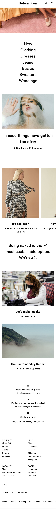
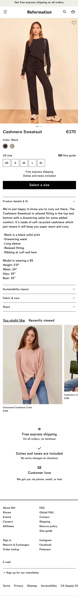

# Procesverslag
**Auteur:** Tamar Langenburg

## Bronnenlijst
1. Deels geraadpleegd om de navigatie bar te te maken.
https://www.w3schools.com/css/css_navbar_horizontal.asp
2. Deze bron heb ik geraadpleegd om uit te zoeken hoe je flexbox gebruikt. 
https://css-tricks.com/snippets/css/a-guide-to-flexbox/
3. Deze bron heb ik geraadpleegd om de sliders werkend te krijgen.
https://css-tricks.com/can-get-pretty-far-making-slider-just-html-css/
4.Deze bronnen heb ik geraadpleegd om tekst over een afbeelding te krijgen. (Zoals op de homepage).
https://www.tutorialrepublic.com/faq/how-to-position-text-over-an-image-using-css.php
https://www.w3schools.com/howto/howto_css_image_text.asp
5. Deze bron heb ik geraadpleegd om de grid op de detailpagina uit te werken.
https://medium.com/@james.ayres/simple-css-grid-tutorial-for-repeatable-content-on-ecommerce-blog-a5f767d96453
6. Deze bron heb ik geraadpleegd om de navigatie bar mee te laten scrollen.
https://www.w3schools.com/howto/howto_css_fixed_menu.asp
7. Deze bron heb ik geraadpleegd om een grid in de footer en productpagina te maken.
https://www.w3schools.com/css/css_grid.asp
https://developer.mozilla.org/en-US/docs/Web/CSS/CSS_Grid_Layout/Basic_Concepts_of_Grid_Layout
8. Ik heb deze link geraadpleegd om een forum te maken.
https://www.w3schools.com/css/css_form.aspd
9. Deze bron heb ik geraadpleegd om de knoppen te stijlen.
https://www.w3schools.com/css/css3_buttons.asp
10. Deze site heb ik gebruikt om iconen te verkrijgen.
https://fontawesome.com/start
11. Dit is de javascript die ik in mijn website heb is geraadpleegd .
https://codepen.io/shooft/pen/vYGdNXx

## Eindgesprek (week 7/8)

Ik vind dat ik persoonlijk een flinke vooruitgang heb gemaakt in coderen. Ik moet nog veel leren, maar ik snap nu in iedergeval wat ik moet doen en hoe. Het was wel stressvol om het allemaal zelf uit te zoeken en hier heb ik ook zeker van geleerd. Ik ga in de toekomst sneller en meer om hulp vragen. 

**Screenshot(s):**

   

## Voortgang 3 (week 6)

### Stand van zaken

Ik ben verder gegaan met de detailpagina. Ik heb vooral dingen uit geprobeert met de microinteracties. Met de vormgeving ben ik nog niet heel blij, hieraan wil ik nog verder werken. 
**Screenshot(s):**

 

### Agenda voor meeting

| Tamar          | Zara.              | Lotte        | Nora             |
| -------------- | ------------------ | ------------ | ---------------- |
| vormgeving     | flexbox            | ...          | positionering    |
| buttons        | image slider       | ...          | ...              |
| microineracties| ...                | ...          | ...              |
| ...            | ...                | ...          | ...              |

### Verslag van meeting

Ik had een probleem met mijn microinteractie. Dit is na deze meeting gelukkig opgelost. Ook heb ik de tip gekregen om zoveel mogelijk classes en divs weg te halen. 

## Voortgang 2 (week 5)

### Stand van zaken

IK ben nu bezig met de detailpagina en heb al veel vooruitgang kunnen maken met de homepage. Ik maak nog kleine stapjes, maar ik merk dat als ik er even goed voor ga zitten dat ik er uiteindelijk wel kom. Het kost mij gewoon meer tijd vooral omdat ik soms blijf hangen bij de kleine details. 
**Screenshot(s):**

 

### Agenda voor meeting

| Tamar          | Zara.              | Lotte        | Nora             |
| -------------- | ------------------ | ------------ | ---------------- |
| navigatiebalk  | style 2e pagina    | margin       | styling          |
| animatie       | css                | knoppen      | Classes divs     |
| flex en grid   | ...                | ...          | ...              |
| ...            | ...                | ...          | ...              |

### Verslag van meeting

IK heb nu een beter idee waar ik mee verder moet. Ik kan nu verder met de bijvoorbeeld de imageslider en navigatiebalk. Als het gaat om de animatie denk ik dat ik er nog even mee wacht. Ik ben nu van plan om weer vanaf het begin te beginnen. Dan heb ik meer een overzicht en kan ik makkelijker nieuwe dingen uit proberen.

## Voortgang 1 (week 3)

### Stand van zaken

Ik ben nu nog bezig met mijn startpagina. Omdat ik niet veel ervaring heb duurt het ietsje langer. Wel kom ik er meestal zelf uit als ik iets niet snap. 

**Screenshot(s):**

### Agenda voor meeting

| Tamar          | Zara.              | Lotte        | Nora             |
| -------------- | ------------------ | ------------ | ---------------- |
| navigatiebalk  | Filmpje afspelen   | Hamburgermenu| positioneren     |
| hamburgermenu  | hamburgermenu      | imageslider  | Flexbox          |
| flex en grid   | image slider       |              |                  |
| uitklap menu   | ...                | ...          | ...              |

### Verslag van meeting

Ik heb nu een beter idee waar ik mee verder moet. Ik kan nu verder met de bijvoorbeeld de imageslider en navigatiebalk. Ook heb ik nu een duidelijker beeld van wat er van mij wordt verwacht.

## Breakdownschets (week 1)

## Intake (week 1)

**Je startniveau:** -blauw-

Ik heb nog weinig ervaring. Daarom zou ik mezelf op de blauwe piste plaatsen.

**Je focus:** -surface plane en responsive-

Ik wil mezelf zoveel mogelijk pushen en kijken hoever ik kom met wat ik responsive kan maken.

**Je opdracht:** 

Ik heb voor de website van The Reformation gekozen om na te maken. De vormgeving van de website spreekt mij aan, het is overzichtelijk en simpel opgebouwd ,en dit zal voor mij al een goede uitdaging zijn.
https://www.thereformation.com/

**Screenshot(s) van de eerste pagina (small screen):**

**Screenshot(s) van de tweede pagina (small screen):**

